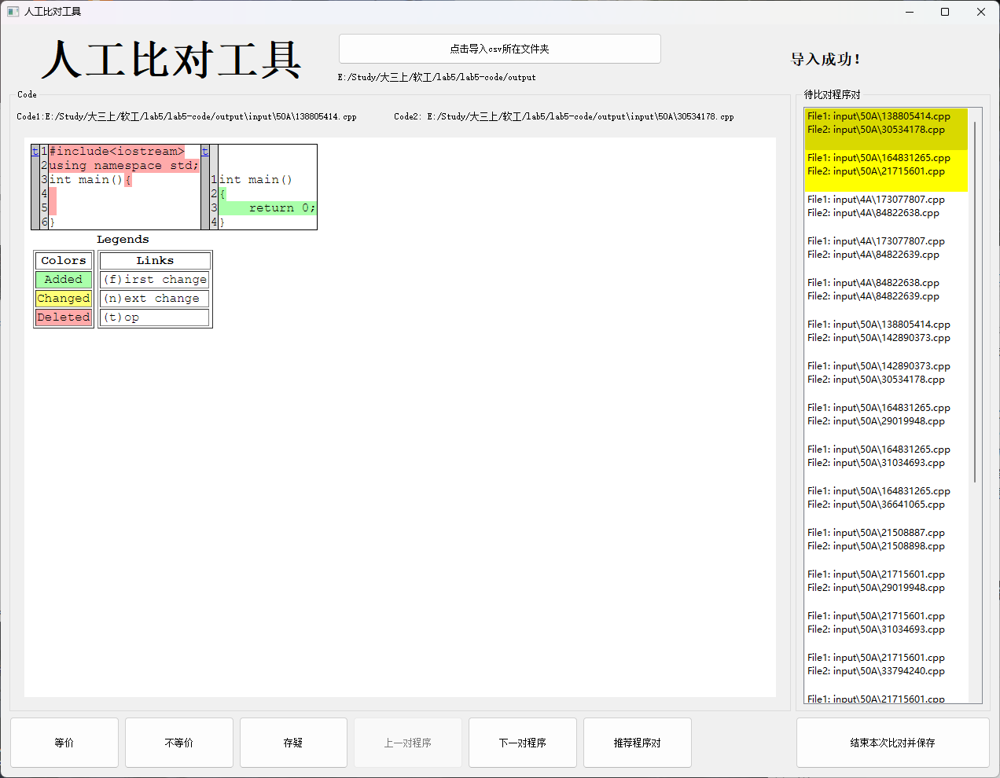

# 软件工程Lab5实验报告

201502002 洪睿琦

## 一、项目简介及环境配置

本次实验目的是为了实现一个具有图形界面的，用于在Lab4自动比对后，对机器可能遗漏的不等价程序进行人工校验的工具。开发环境上，我选择了使用Qt库来实现图形化功能，并且选择了Qt官方推荐使用的Python库PySide2来实现在Python环境下调用Qt库。因此本次项目的环境要求安装Python3和PySide2两个库，后者可以在安装了Python3的基础上，通过`pip3 install PySide2`来安装。

## 二、软件特点与使用方法介绍

如下为本软件正常打开时的界面：

要进行人工对比，第一步要做的事情是导入由机器分析程序的输出文件以及源程序，导入方法如下：

1. **首先将input文件夹（包含待分析源码）、机器分析程序导出的equal.csv、inequal.csv放入一个目录**

2. **点击“点击导入csv所在文件夹”按钮，选择该目录**

   

导入后，软件会对所选择目录的合法性进行检验（检查equal.csv和inequal.csv的存在和其内容中包含的代码路径是否能够被访问到）若发现选择的文件夹不符合要求，程序将如下图跳出窗口提示导入失败：

若导入成功，软件将进入比对界面：

如上图，软件将在右侧展示需要进行人工比对的程序对列表（包括了equal.csv和suspect.csv中的程序对，其中后者是存疑的程序对将在后面提到，而因为inequal.csv中的程序对一定不等价，无需人工判断，故不会出现在这里）

左侧为程序展示区，**它将显示选中程序对的code diff**，这里的code diff是通过python标准库中的difflib实现的，用户可以比较轻松的看出两个程序的相同之处和不同之处，从而比较轻松的完成判断。

用户可以通过直接点击右侧列表的每个项目来选择不同的程序对，也可以通过按钮：“下一对程序”、“上一对程序”、“推荐程序对”来进行程序对的切换。**“推荐程序对”的逻辑是根据用户的点击频率，以一定机制选择出可能需要被用户多次观看的程序。**

通过按钮“等价”、“不等价”、“存疑”，用户可以切换当前程序对的状态。被标记为“存疑”的程序将在列表中以黄色高亮展示，而被标记为“不等价”的程序将在列表中以红色高亮展示，如下图。

（图中有两对程序被标记为不等价，两对程序被标记为存疑）

当用户打算结束本次比对的时候，可以点击右下角的“结束本次比对并保存”按钮。此时，选中目录中的部分文件内容将被改写，具体而言：equal.csv和inequal.csv中的内容将会根据用户对程序对的状态改变进行重写。特别的是，如果退出时仍有存疑程序，将生成一个新的suspect.csv文件，其中保存了被标记为存疑的程序对。当下一次加载该文件夹时，这些存疑的程序对将被置顶，且高亮标记为黄色。**这个功能为用户分多次进行人工比对提供了便利。**

（保存后重新打开将把上次保存时被标记为存疑的程序高亮并置顶）

## 三、程序运行方法与发布

要运行程序，可以通过安装运行环境（python3和PySide2），然后在主目录下使用`python3 main.py`来执行程序。

为了便于用户使用，使用了pyinstaller对程序进行打包发布，这使得用户可以在不安装python解释器和PySide2的条件下运行程序，只需在根目录下的dist/main中，运行main.exe即可。

**因为文件过大，在提交的文件夹中没有dist/main目录，若需要可以到[TieKotek/SElab5: 软件工程实验5 (github.com)](https://github.com/TieKotek/SElab5)下载。**

（点击main.exe即可运行，不需特意安装环境）

## 四、git尝试

本次实验也通过git进行开发维护，下面展示了部分本次开发的流程：

初始化仓库并且连接到远程仓库。

创建一些基本文件，并进行第一次提交。

创建ui_design分支，并在上面进行前端开发。

同理还创建了backend_dev分支进行了后端开发。

在上述两个分支完成后，通过git merge将ui_design和backend_dev两个分支合并到主分支main上，并通过git log展示结果：

经过测试，对源代码进行了一些修改，使用git diff展示修改前后的区别：

push到远程仓库

本次实验的代码可以在[TieKotek/SElab5: 软件工程实验5 (github.com)](https://github.com/TieKotek/SElab5)中找到。

